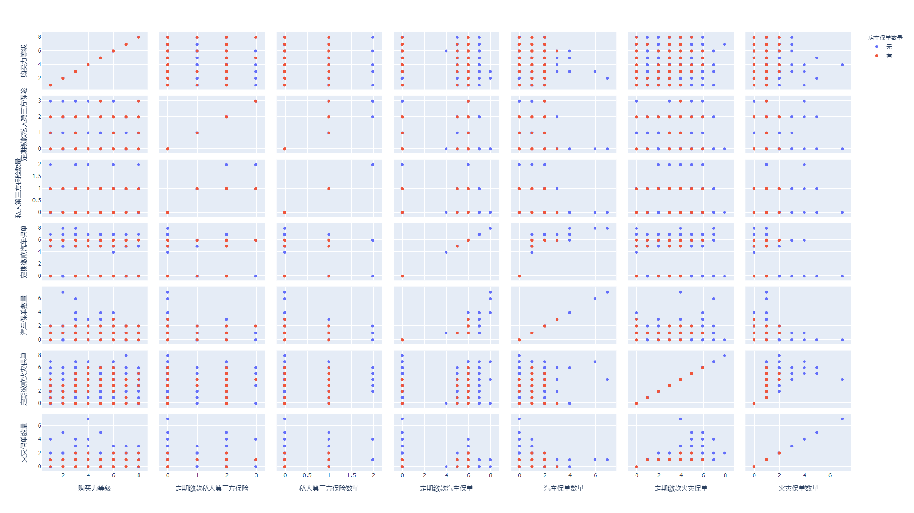

# 伯努利朴素贝叶斯预测客户购买房车险
根据2000年数据挑战赛保险公司的客户特征数据，预测客户是否会购买房车险。<br/>
使用伯努利朴素贝叶斯模型，我获得了更好的预测效果

[数据集导航 - 保险](https://leon_xi.gitee.io/da123/#/%E5%85%B6%E5%AE%83/%E4%BF%9D%E9%99%A9)
[加州大学机器学习库 - 数据来源](http://archive.ics.uci.edu/ml/datasets/Insurance+Company+Benchmark+%28COIL+2000%29)

#### 数据集信息
有关客户的信息包含86个变量，包括从邮政编码区域代码得出的产品使用数据和社会人口统计数据。数据是由荷兰数据挖掘公司Sentient Machine Research提供的，并且基于现实世界中的业务问题。培训集包含超过5000个客户描述，包括有关他们是否具有商队保险政策的信息。测试集包含4000位客户，只有组织者才能知道其中是否有商队保险单。

数据字典（[Web链接]）描述了所使用的变量及其值。

注意：所有以M开头的变量都是邮政编码变量。它们在客户的邮政编码区域中提供有关该变量（例如出租房屋）的分布的信息。

每行包含一个制表符分隔字段的实例。

TICDATA2000.txt：用于训练和验证预测模型并建立描述的数据集（5822客户记录）。每个记录包含86个属性，其中包含社会人口统计数据（属性1-43）和产品所有权（属性44-86）。社会人口统计学数据来自邮政编码。所有居住在具有相同邮政编码的地区的客户都具有相同的社会人口统计属性。目标变量为属性86“ CARAVAN：房车险保单数量”。

TICEVAL2000.txt：预测数据集（4000个客户记录）。它具有与TICDATA2000.txt相同的格式，仅缺少目标。参与者只应返回预测目标的列表。所有数据集均采用制表符分隔格式。属性和属性值的含义如下。

TICTGTS2000.txt评估集的目标。

#### 特征选择
使用统计的方式，对训练数据集中，持有房车险的客户数据进行了分析，发现以下的特征具有很强的相关性：

* 43 购买力等级
* 44 定期缴款私人第三方保险
* 47 定期缴款汽车保单
* 59 定期缴款火灾保单
* 65 私人第三方保险数量
* 68 汽车保单数量
* 80 火灾保单数量



[数据可视化](tic_visualizations.ipynb)

统计表和分析过程如下：
```
> [ ] [01] 客户子分类 1: 0.03736, 2: 0.01724, 3: 0.07184, 4: 0.00575, 5: 0.00575, 6: 0.03448, 7: 0.00862, 8: 0.14655, 9: 0.03448, 10: 0.02586, 11: 0.02586, 12: 0.04598, 13: 0.03736, 20: 0.00575, 22: 0.01149, 23: 0.01149, 24: 0.01437, 25: 0.00575, 26: 0.00287, 27: 0.00287, 29: 0.00575, 30: 0.01149, 31: 0.01724, 32: 0.02299, 33: 0.13218, 34: 0.02586, 35: 0.02299, 36: 0.04598, 37: 0.02874, 38: 0.06609, 39: 0.05460, 41: 0.01437
> [ ] [02] 房产数量 1: 0.90517, 2: 0.09483
> [ ] [03] 平均房产面积 1: 0.02299, 2: 0.33046, 3: 0.49138, 4: 0.14368, 5: 0.01149
> [ ] [04] 平均年龄 1: 0.00287, 2: 0.25000, 3: 0.52586, 4: 0.18391, 5: 0.03448, 6: 0.00287
> [ ] [05] 客户主分类 1: 0.13793, 2: 0.18966, 3: 0.16954, 5: 0.04310, 6: 0.01149, 7: 0.05747, 8: 0.25575, 9: 0.12069, 10: 0.01437
> [ ] [06] 天主教 0: 0.50862, 1: 0.30747, 2: 0.15517, 3: 0.02011, 4: 0.00287, 5: 0.00287, 6: 0.00287
> [ ] [07] 新教 0: 0.00287, 1: 0.01437, 2: 0.06897, 3: 0.08333, 4: 0.25000, 5: 0.27874, 6: 0.11207, 7: 0.15805, 8: 0.00862, 9: 0.02299
> [ ] [08] 其它教派 0: 0.37356, 1: 0.26724, 2: 0.28448, 3: 0.05172, 4: 0.02011, 5: 0.00287
> [ ] [09] 非教徒 0: 0.10632, 1: 0.06034, 2: 0.19828, 3: 0.25000, 4: 0.20115, 5: 0.14655, 6: 0.01149, 7: 0.02586
> [ ] [10] 已婚 0: 0.00575, 1: 0.00287, 2: 0.00862, 3: 0.01724, 4: 0.02874, 5: 0.13793, 6: 0.20402, 7: 0.33333, 8: 0.07184, 9: 0.18966
> [ ] [11] 同居 0: 0.46264, 1: 0.34483, 2: 0.16954, 3: 0.02011, 4: 0.00287
> [ ] [12] 其它关系 0: 0.26724, 1: 0.09483, 2: 0.31609, 3: 0.21264, 4: 0.07471, 5: 0.01724, 6: 0.01149, 7: 0.00287, 9: 0.00287
> [ ] [13] 单身 0: 0.36782, 1: 0.18391, 2: 0.21552, 3: 0.11782, 4: 0.06034, 5: 0.03736, 6: 0.01149, 7: 0.00287, 8: 0.00287
> [ ] [14] 有房没有孩子 0: 0.06609, 1: 0.06897, 2: 0.16379, 3: 0.25575, 4: 0.25287, 5: 0.08621, 6: 0.07759, 7: 0.02299, 8: 0.00287, 9: 0.00287
> [ ] [15] 有房有孩子 0: 0.01437, 1: 0.02874, 2: 0.11207, 3: 0.16954, 4: 0.18966, 5: 0.16667, 6: 0.16092, 7: 0.06609, 8: 0.05172, 9: 0.04023
> [ ] [16] 高等学历 0: 0.26149, 1: 0.20977, 2: 0.20115, 3: 0.11207, 4: 0.10632, 5: 0.06034, 6: 0.02299, 7: 0.01724, 8: 0.00575, 9: 0.00287
> [ ] [17] 中等学历 0: 0.04023, 1: 0.06322, 2: 0.13793, 3: 0.22989, 4: 0.24713, 5: 0.15517, 6: 0.05460, 7: 0.05172, 8: 0.00862, 9: 0.01149
> [ ] [18] 低等学历 0: 0.08333, 1: 0.07759, 2: 0.18678, 3: 0.13506, 4: 0.14655, 5: 0.14080, 6: 0.09195, 7: 0.07759, 8: 0.03736, 9: 0.02299
> [ ] [19] 地位高 0: 0.20977, 1: 0.17529, 2: 0.22414, 3: 0.15230, 4: 0.09483, 5: 0.03736, 6: 0.05172, 7: 0.04023, 8: 0.00862, 9: 0.00575
> [ ] [20] 企业家 0: 0.66954, 1: 0.23563, 2: 0.07471, 3: 0.00862, 4: 0.00287, 5: 0.00862
> [ ] [21] 农民 0: 0.81609, 1: 0.10345, 2: 0.05747, 3: 0.01724, 4: 0.00287, 5: 0.00287
> [ ] [22] 中层管理人员 0: 0.10057, 1: 0.05460, 2: 0.24425, 3: 0.19540, 4: 0.17529, 5: 0.09483, 6: 0.04885, 7: 0.06322, 9: 0.02299
> [ ] [23] 技术工人 0: 0.22126, 1: 0.23851, 2: 0.24713, 3: 0.14080, 4: 0.07184, 5: 0.03736, 6: 0.01724, 7: 0.01437, 8: 0.00862, 9: 0.00287
> [ ] [24] 非熟练工人 0: 0.22414, 1: 0.21839, 2: 0.23563, 3: 0.14368, 4: 0.10920, 5: 0.04310, 6: 0.01724, 7: 0.00575, 8: 0.00287
> [ ] [25] A类 0: 0.24138, 1: 0.22989, 2: 0.19253, 3: 0.13793, 4: 0.08333, 5: 0.04023, 6: 0.03448, 7: 0.03736, 8: 0.00287
> [ ] [26] B1类 0: 0.20690, 1: 0.23276, 2: 0.29023, 3: 0.18678, 4: 0.05460, 5: 0.01149, 6: 0.01437, 8: 0.00287
> [ ] [27] B2类 0: 0.16667, 1: 0.13506, 2: 0.28736, 3: 0.20977, 4: 0.13506, 5: 0.04885, 6: 0.01724
> [ ] [28] C类 0: 0.07184, 1: 0.08621, 2: 0.20402, 3: 0.17529, 4: 0.17816, 5: 0.13218, 6: 0.08333, 7: 0.02874, 8: 0.02299, 9: 0.01724
> [ ] [29] D类 0: 0.54023, 1: 0.28161, 2: 0.11494, 3: 0.04023, 4: 0.01437, 5: 0.00287, 6: 0.00287, 7: 0.00287
> [ ] [30] 租房 0: 0.27011, 1: 0.10632, 2: 0.10920, 3: 0.11207, 4: 0.07471, 5: 0.07184, 6: 0.06609, 7: 0.05460, 8: 0.04598, 9: 0.08908
> [ ] [31] 房东 0: 0.08908, 1: 0.04598, 2: 0.05460, 3: 0.06609, 4: 0.07184, 5: 0.07471, 6: 0.11207, 7: 0.10920, 8: 0.10632, 9: 0.27011
> [ ] [32] 1辆车 2: 0.00287, 3: 0.02011, 4: 0.03736, 5: 0.16954, 6: 0.26149, 7: 0.34195, 8: 0.05460, 9: 0.11207
> [ ] [33] 2辆车 0: 0.30747, 1: 0.24138, 2: 0.32184, 3: 0.06322, 4: 0.05460, 5: 0.00862, 6: 0.00287
> [ ] [34] 没有车 0: 0.34770, 1: 0.13793, 2: 0.31034, 3: 0.14080, 4: 0.03736, 5: 0.01149, 6: 0.01437
> [ ] [35] 国家健康保险 0: 0.02011, 2: 0.07759, 3: 0.04310, 4: 0.08046, 5: 0.20690, 6: 0.12931, 7: 0.25000, 8: 0.08046, 9: 0.11207
> [ ] [36] 私人健康保险 0: 0.11207, 1: 0.08046, 2: 0.25000, 3: 0.12931, 4: 0.20690, 5: 0.08046, 6: 0.04310, 7: 0.07759, 9: 0.02011
> [ ] [37] 收入小于3万 0: 0.28161, 1: 0.15517, 2: 0.26149, 3: 0.14368, 4: 0.06034, 5: 0.04885, 6: 0.02586, 7: 0.02011, 8: 0.00287
> [ ] [38] 收入介于3万和4万5之间 0: 0.07471, 1: 0.05172, 2: 0.15805, 3: 0.21264, 4: 0.24138, 5: 0.12931, 6: 0.07184, 7: 0.02874, 8: 0.00575, 9: 0.02586
> [ ] [39] 收入介于4万5和7万5之间 0: 0.10920, 1: 0.06897, 2: 0.13793, 3: 0.24138, 4: 0.25287, 5: 0.11782, 6: 0.03161, 7: 0.02011, 8: 0.00862, 9: 0.01149
> [ ] [40] 收入介于7万5和12万2之间 0: 0.43678, 1: 0.27874, 2: 0.16667, 3: 0.05460, 4: 0.04023, 5: 0.02011, 9: 0.00287
> [ ] [41] 收入大于12万3 0: 0.83046, 1: 0.14368, 2: 0.02299, 3: 0.00287
> [ ] [42] 平均收入 1: 0.00287, 2: 0.05747, 3: 0.19828, 4: 0.39943, 5: 0.20115, 6: 0.06897, 7: 0.04885, 8: 0.02299
> [*] [43] 购买力等级 1: 0.05172, 2: 0.04310, 3: 0.20402, 4: 0.13218, 5: 0.08621, 6: 0.18966, 7: 0.19253, 8: 0.10057
> [*] [44] 定期缴款私人第三方保险 0: 0.42241, 1: 0.02299, 2: 0.54885, 3: 0.00575
> [-] [45] 定期缴款第三方保险(公司) 0: 0.98563, 2: 0.00575, 3: 0.00862
> [-] [46] 定期缴款第三方保险(农业) 0: 0.99138, 3: 0.00575, 4: 0.00287
> [*] [47] 定期缴款汽车保单 0: 0.20690, 5: 0.04023, 6: 0.75287
> [-] [48] 定期缴款货车保单 0: 0.99425, 6: 0.00575
> [-] [49] 定期缴款摩托车/踏板车保单 0: 0.95402, 3: 0.00575, 4: 0.02586, 5: 0.01149, 6: 0.00287
> [-] [50] 定期缴款卡车保单 0: 1.00000
> [-] [51] 定期缴款拖挂车保单 0: 0.98276, 1: 0.00287, 2: 0.01437
> [-] [52] 定期缴款拖拉机保单 0: 0.98563, 3: 0.00575, 5: 0.00575, 6: 0.00287
> [-] [53] 定期缴款农业机械保单 0: 1.00000
> [-] [54] 定期缴款轻便摩托车保单 0: 0.97701, 2: 0.00287, 3: 0.01724, 5: 0.00287
> [-] [55] 定期缴款人寿保险 0: 0.93391, 3: 0.01724, 4: 0.03161, 5: 0.01149, 6: 0.00575
> [-] [56] 定期缴款私人意外保险保单 0: 0.99713, 2: 0.00287
> [-] [57] 定期缴款家庭意外保险保单 0: 0.98276, 2: 0.00575, 3: 0.01149
> [-] [58] 定期缴款伤残保险保单 0: 0.98851, 6: 0.01149
> [*] [59] 定期缴款火灾保单 0: 0.31322, 1: 0.00862, 2: 0.01724, 3: 0.19540, 4: 0.43391, 5: 0.02299, 6: 0.00862
> [-] [60] 定期缴款冲浪板保单 0: 0.99713, 1: 0.00287
> [-] [61] 定期缴款船只保单 0: 0.96264, 1: 0.00862, 2: 0.00575, 3: 0.00575, 4: 0.01149, 6: 0.00575
> [-] [62] 定期缴款自行车保单 0: 0.95690, 1: 0.04310
> [-] [63] 定期缴款财产保险保单 0: 0.98563, 1: 0.00862, 2: 0.00575
> [-] [64] 定期缴款社会保障保险保单 0: 0.95402, 2: 0.01149, 3: 0.01149, 4: 0.02299
> [*] [65] 私人第三方保险数量 0: 0.42241, 1: 0.57759
> [-] [66] 第三方保险(公司)数量 0: 0.98563, 1: 0.01437
> [-] [67] 第三方保险(农业)数量 0: 0.99138, 1: 0.00862
> [*] [68] 汽车保单数量 0: 0.20690, 1: 0.68103, 2: 0.10920, 3: 0.00287
> [-] [69] 货车保单数量 0: 0.99425, 1: 0.00575
> [-] [70] 摩托车/踏板车保单数量 0: 0.95402, 1: 0.04310, 2: 0.00287
> [-] [71] 卡车保单数量 0: 1.00000
> [-] [72] 拖挂车保单数量 0: 0.98276, 1: 0.01724
> [-] [73] 拖拉机保单数量 0: 0.98563, 1: 0.01149, 2: 0.00287
> [-] [74] 农业机械保单数量 0: 1.00000
> [-] [75] 轻便摩托车保单数量 0: 0.97701, 1: 0.02299
> [-] [76] 人寿保险数量 0: 0.93391, 1: 0.02299, 2: 0.02874, 3: 0.00575, 4: 0.00862
> [-] [77] 私人意外保险保单数量 0: 0.99713, 1: 0.00287
> [-] [78] 家庭意外保险保单数量 0: 0.98276, 1: 0.01724
> [-] [79] 伤残保险保单数量 0: 0.98851, 1: 0.01149
> [*] [80] 火灾保单数量 0: 0.31322, 1: 0.66667, 2: 0.02011
> [-] [81] 冲浪板保单数量 0: 0.99713, 1: 0.00287
> [-] [82] 船只保单数量 0: 0.96264, 1: 0.03448, 2: 0.00287
> [-] [83] 自行车保单数量 0: 0.95690, 1: 0.02874, 2: 0.01149, 3: 0.00287
> [-] [84] 财产保险保单数量 0: 0.98563, 1: 0.01437
> [-] [85] 社会保障保险保单数量 0: 0.95402, 1: 0.04598
```

#### 模型训练
由于房车险保单持有客户在训练数据集中只占不到 6% 的比例，如果使用全部的数据进行训练，预测非保有客户的训练会过拟合，而预测保有客户的训练则会欠拟合。<br/>
因此，需要减少非保有客户的数据用于模型训练，经过多次尝试，只取其中的 1/20 用于训练最佳。

因为目标训练数据过少，为了防止训练欠拟合，需要增加特征数<br/>
使用叉积的增加的特征，不会与其它已有的特征产生相关性。

* 86 汽车保险叉积*
```
47 定期缴款汽车保单
x
68 汽车保单数量
```

* 87 火灾保险叉积*
```
59 定期缴款火灾保单
x
80 火灾保单数量
```

观察提供的数据集可以发现，数据已经进行过处理成离散数据，目标是二值（0, 1）预测<br/>
判断适合使用朴素贝叶斯模型进行训练和预测<br/>
尝试使用 高斯朴素贝叶斯分类器(GaussianNB)、多项式朴素贝叶斯分类器(MultinomialNB)、分类特征朴素贝叶斯分类器(CategoricalNB)、补全朴素贝叶斯分类器(ComplementNB) 和 伯努利朴素贝叶斯分类器(BernoulliNB) 进行训练<br/>
发现，伯努利朴素贝叶斯分类器(BernoulliNB)可以获得最好的效果

> py train.py

```
加载 TIC 2000 数据

数据集
已加载 621 训练数据集（离散数据）, 包含 87 个特征
预测目标购买房车险的客户共 348 个

选择训练特征
86 汽车保险叉积*
87 火灾保险叉积*
43 购买力等级
44 定期缴款私人第三方保险
47 定期缴款汽车保单
59 定期缴款火灾保单
65 私人第三方保险数量
68 汽车保单数量
80 火灾保单数量

训练模型

评分
0.6505636070853462
```

#### 模型测试

> py test.py

```
加载 TIC 2000 测试数据

数据集
已加载 4000 测试数据集（离散数据）, 包含 87 个特征
预测最有可能购买房车险的800名客户，寻找与实际符合最多的算法，实际存在 238 个

过滤特征
86 汽车保险叉积*
87 火灾保险叉积*
43 购买力等级
44 定期缴款私人第三方保险
47 定期缴款汽车保单
59 定期缴款火灾保单
65 私人第三方保险数量
68 汽车保单数量
80 火灾保单数量

模型测试

测试结果
最可能的800个客户中，准确命中了 135 个客户。
```

#### 引用
```
@misc{
  Dua:2019 ,
  author = "Dua, Dheeru and Graff, Casey",
  year = "2017",
  title = "{UCI} Machine Learning Repository",
  url = "http://archive.ics.uci.edu/ml",
  institution = "University of California, Irvine, School of Information and Computer Sciences"
}
```
